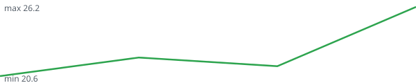

# daily-data-tracker

A small data pipeline that runs every day and builds its own dataset over time:

- **Weather in Breda** (max/min temperature, rain, sunshine) from [Open-Meteo](https://open-meteo.com/) (CC BY 4.0)
- **EUR exchange rates** (USD, GBP, CHF, TRY) from the ECB via [Frankfurter](https://www.frankfurter.app/)

Pure Python standard library for the pipeline; `pytest` for tests.

```bash
python -m tracker.run fetch            # store yesterday's data (safe to re-run)
python -m tracker.run fetch 2026-09-01 # backfill a specific day
python -m tracker.run report           # rebuild the stats below + chart
python -m pytest
```

## Max temperature, last 60 days

Solid green: daily max · dashed blue: trailing 7-day average (appears once 7 days are stored).



## Stats

<!-- stats:start -->
**Days tracked:** 8 weather · 6 FX

- Average max temperature: **21.9 °C**
- Warmest day: **26.2 °C** · Coldest max: **19.5 °C**
- Total rain: **5.4 mm** · Dry days: **4**
- Longest dry streak: **2 days** (2026-09-26 → 2026-09-27)
- Longest warm streak (max > 20 °C): **6 days** (2026-09-26 → 2026-10-01)
- Rain vs. sunshine correlation: **r = -0.68**

Last 7 days (Breda):

| Date | Max °C | Min °C | Rain mm | Sun h |
|---|---|---|---|---|
| 2026-10-03 | 19.7 | 7.9 | 0.0 | 9.49 |
| 2026-10-02 | 19.5 | 10.8 | 0.0 | 9.65 |
| 2026-10-01 | 21.0 | 14.4 | 2.2 | 8.27 |
| 2026-09-30 | 24.8 | 17.8 | 1.2 | 5.74 |
| 2026-09-29 | 26.2 | 15.5 | 0.1 | 10.65 |
| 2026-09-28 | 21.4 | 15.1 | 1.9 | 5.42 |
| 2026-09-27 | 22.1 | 10.6 | 0.0 | 11.0 |

Latest EUR rates (2026-10-02): USD 1.1225 · GBP 0.85033 · CHF 0.9279 · TRY 55.165

Change vs. 2026-10-01: USD -0.65% · GBP -0.40% · CHF -1.67% · TRY -0.42%

Biggest single-day move since tracking started: CHF -1.67% on 2026-10-02

<!-- stats:end -->

## Roadmap

- [ ] Monthly summary notebook (pandas)
- [x] Rain vs. sunshine correlation
- [ ] Weekday vs. weekend exchange-rate gaps
- [x] Day-over-day % change for each EUR rate
- [x] Rolling 7-day average temperature in the chart
- [x] Biggest single-day FX move since tracking started
- [x] Longest dry-day streak in Breda
- [x] Longest warm streak (max temperature above 20 °C)
- [ ] Coldest night (lowest min temperature) and its date
