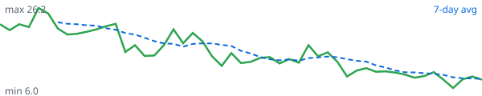

# daily-data-tracker

A small data pipeline that runs every day and builds its own dataset over time:

- **Weather in Breda** (max/min temperature, rain, sunshine) from [Open-Meteo](https://open-meteo.com/) (CC BY 4.0)
- **EUR exchange rates** (USD, GBP, CHF, TRY) from the ECB via [Frankfurter](https://www.frankfurter.app/)

Pure Python standard library for the pipeline; `pytest` for tests.

```bash
python -m tracker.run fetch            # store yesterday's data (safe to re-run)
python -m tracker.run fetch 2026-09-01 # backfill a specific day
python -m tracker.run report           # rebuild the stats below + chart
python -m pytest
```

## Max temperature, last 60 days

Solid green: daily max · dashed blue: trailing 7-day average (appears once 7 days are stored).



## Stats

<!-- stats:start -->
**Days tracked:** 62 weather · 44 FX

- Average max temperature: **13.6 °C**
- Warmest day: **26.2 °C** · Coldest max: **2.5 °C**
- Last 7 days vs. the 7 before (avg max): **5.9 °C** vs. 9.7 °C (-3.8 °C)
- Total rain: **182.9 mm** · Dry days: **23**
- Coldest night: **-3.6 °C** on 2026-11-24
- First frost: **-1.2 °C** on 2026-11-10
- First frost-risk night (min below 3 °C): **1.6 °C** on 2026-11-06 (week 45), 15 such nights so far
- Warmest night: **17.8 °C** on 2026-09-30
- Largest day/night range: **13.4 °C** on 2026-09-25
- Sunniest day: **11.1 h** on 2026-09-25 · Average sunshine: **6.9 h/day**
- Wettest day: **28.7 mm** on 2026-10-23
- Wettest day's share of all rain: **16%** (28.7 mm on 2026-10-23)
- Share of rain from the 3 wettest days: **38%** (2026-10-23 28.7 mm, 2026-11-17 20.7 mm, 2026-10-24 20.4 mm)
- Rain intensity (wet days only): **4.7 mm/day** over 39 wet days
- Rainiest week: **68.3 mm** (2026-10-20 → 2026-10-26)
- Longest dry streak: **5 days** (2026-10-02 → 2026-10-06)
- Longest wet run: **12 days** (2026-10-16 → 2026-10-27), 82.9 mm at 6.9 mm/day
- Wettest run by total rain: **82.9 mm** over 12 days (2026-10-16 → 2026-10-27)
- Wet spells of 3+ days: 6; latest **7.5 mm/day** over 7 days (2026-11-15 → 2026-11-21) vs. 2.4 mm/day over 4 days (2026-11-10 → 2026-11-13), heavier
- Dry spells of 3+ days: 4 (lengths 3, 5, 3, 4); latest **4 days** (2026-11-22 → 2026-11-25) vs. 3 days (2026-11-04 → 2026-11-06), longer
- Sunshine during dry spells (avg h/day): 2026-09-25 → 2026-09-27 9.9 h · 2026-10-02 → 2026-10-06 10.2 h · 2026-11-04 → 2026-11-06 8.6 h · 2026-11-22 → 2026-11-25 7.6 h
- Sunshine during wet spells (avg h/day): 2026-09-28 → 2026-10-01 7.5 h · 2026-10-07 → 2026-10-11 8.1 h · 2026-10-16 → 2026-10-27 5.9 h · 2026-11-01 → 2026-11-03 2.3 h · 2026-11-10 → 2026-11-13 5.8 h · 2026-11-15 → 2026-11-21 3.5 h
- Dry vs. wet spell sunshine: **+3.6 h/day** (9.1 h over 15 dry-spell days vs. 5.6 h over 35 wet-spell days)
- Dry vs. wet spell temperature: days **+0.5 °C** (14.0 vs. 13.5 °C max), nights **-2.2 °C** (5.3 vs. 7.5 °C min) over 15 dry-spell and 35 wet-spell days
- Current run: **4 dry days in a row** since 2026-11-22
- Longest warm streak (max > 20 °C): **7 days** (2026-09-25 → 2026-10-01)
- Wettest weekday so far: **Friday** (5.6 mm on average over 9 days)
- Sunniest weekday so far: **Thursday** (8.2 h on average over 8 days)
- Cloudiest weekday by sunshine share: **Wednesday** (58% of possible sun on average over 9 days)
- Mildest nights by weekday: **Thursday** (7.9 °C average min over 8 days)
- Coldest days by weekday: **Saturday** (12.8 °C average max over 9 days)
- Widest day/night range by weekday: **Tuesday** (8.3 °C average max − min over 9 days)
- Day/night range by week: 9.5 → 10.4 → 7.2 → 6.2 → 4.9 → 5.1 → 6.4 → 7.4 → 5.7 °C; latest week (2026-11-19 → 2026-11-25) **5.7 °C** vs. 9.5 °C in the first, narrowing
- Sunshine by week: 8.6 → 9.6 → 8.4 → 6.5 → 6.3 → 5.5 → 6.3 → 5.1 → 6.0 h/day; latest week (2026-11-19 → 2026-11-25) **6.0 h/day** vs. 8.6 h in the first, darker
- Sunshine as share of daylight by week: 73% → 85% → 78% → 62% → 63% → 57% → 69% → 58% → 72%; latest week (2026-11-19 → 2026-11-25) **72%** of possible sun vs. 73% in the first, cloudier
- Nights by week (avg min): 13.4 → 10.3 → 9.2 → 8.5 → 8.8 → 6.0 → 2.3 → 2.3 → 0.2 °C; latest week (2026-11-19 → 2026-11-25) **0.2 °C** vs. 13.4 °C in the first, colder
- Frost-risk nights by week (min below 3 °C): 0 → 0 → 0 → 0 → 0 → 0 → 4 → 5 → 6; latest week (2026-11-19 → 2026-11-25) **6 of 7 nights**
- Frost nights by week (min below 0 °C): 0 → 0 → 0 → 0 → 0 → 0 → 1 → 0 → 4; latest week (2026-11-19 → 2026-11-25) **4 of 7 nights** vs. 6 frost-risk
- Dry days by weekday: Mon 4/9 · Tue 2/9 · Wed 4/9 · Thu 2/8 · Fri 4/9 · Sat 4/9 · Sun 3/9
- Weekend vs. weekday rain: **3.0 mm/day** over 18 weekend days vs. 2.9 mm/day over 44 weekdays
- Weekend vs. weekday sunshine: **7.5 h/day** over 18 weekend days vs. 6.6 h/day over 44 weekdays
- Weekend vs. weekday max temperature: **12.9 °C** over 18 weekend days vs. 13.9 °C over 44 weekdays (-1.0 °C)
- Weekend vs. weekday night (min) temperature: **6.0 °C** over 18 weekend days vs. 6.9 °C over 44 weekdays (-0.9 °C)
- Rain vs. sunshine correlation: **r = -0.36**

Last 7 days (Breda):

| Date | Max °C | Min °C | Rain mm | Sun h |
|---|---|---|---|---|
| 2026-11-25 | 2.5 | -1.5 | 0.0 | 6.16 |
| 2026-11-24 | 2.5 | -3.6 | 0.0 | 8.14 |
| 2026-11-23 | 3.6 | -2.3 | 0.0 | 8.15 |
| 2026-11-22 | 5.7 | -1.2 | 0.0 | 7.86 |
| 2026-11-21 | 8.9 | 0.5 | 0.1 | 7.96 |
| 2026-11-20 | 7.1 | 2.4 | 9.3 | 0.0 |
| 2026-11-19 | 10.7 | 7.1 | 8.4 | 4.08 |

Latest EUR rates (2026-11-25): USD 1.0935 · GBP 0.8373 · CHF 0.9085 · TRY 55.4163

Change vs. 2026-11-24: USD -0.26% · GBP +0.04% · CHF -1.07% · TRY -0.16%

Change since tracking started (2026-09-25): USD -4.10% · GBP -2.69% · CHF -3.81% · TRY -0.68%

Biggest single-day move since tracking started: CHF -1.67% on 2026-10-02

Best and worst 5-business-day move:

- USD: best **+1.20%** (2026-10-28 → 2026-11-04) · worst **-2.01%** (2026-11-10 → 2026-11-17)
- GBP: best **+0.53%** (2026-11-18 → 2026-11-25) · worst **-1.24%** (2026-09-28 → 2026-10-05)
- CHF: best **+1.35%** (2026-11-06 → 2026-11-13) · worst **-1.78%** (2026-09-30 → 2026-10-07)
- TRY: best **+1.58%** (2026-10-28 → 2026-11-04) · worst **-1.64%** (2026-11-10 → 2026-11-17)

Realised volatility (std. dev. of daily moves, 43 moves): USD 0.34% · GBP 0.19% · CHF 0.40% · TRY 0.35%

10-move volatility, first window → latest: USD 0.41% → 0.24% (calmer) · GBP 0.21% → 0.15% (calmer) · CHF 0.63% → 0.41% (calmer) · TRY 0.39% → 0.26% (calmer)

Calmest → choppiest over the latest 10 moves: GBP 0.15% < USD 0.24% < TRY 0.26% < CHF 0.41% (calmest: **GBP**)

Longest calm USD stretch (no daily move above 0.5%): **20 business days** (2026-10-07 → 2026-11-03)

Weekend gaps vs. weekdays (avg absolute move):

- USD: **0.26%** over 9 gaps vs. 0.29% over 34 weekday moves (about the same)
- GBP: **0.20%** over 9 gaps vs. 0.15% over 34 weekday moves (gaps larger)
- CHF: **0.19%** over 9 gaps vs. 0.31% over 34 weekday moves (gaps smaller)
- TRY: **0.22%** over 9 gaps vs. 0.29% over 34 weekday moves (gaps smaller)

<!-- stats:end -->

## Roadmap

- [ ] Monthly summary notebook (pandas)
- [x] Rain vs. sunshine correlation
- [x] Weekday vs. weekend exchange-rate gaps
- [x] Weekend-gap vs. weekday moves for GBP, CHF and TRY too
- [ ] Month-over-month change of each EUR rate once two month-ends are stored
- [x] Day-over-day % change for each EUR rate
- [x] Rolling 7-day average temperature in the chart
- [x] Biggest single-day FX move since tracking started
- [x] Longest dry-day streak in Breda
- [x] Longest warm streak (max temperature above 20 °C)
- [x] Coldest night (lowest min temperature) and its date
- [x] Largest day/night temperature range (max − min) and its date
- [x] Sunniest day and average daily sunshine hours
- [x] Wettest day (most rain) and its date
- [x] Warmest night (highest min temperature) and its date
- [x] Longest stretch without a USD/EUR move above 0.5%
- [x] Rainiest week (highest 7-day rolling rain total)
- [x] Week-over-week change in average max temperature
- [ ] Monthly averages table (max/min temperature, rain, sunshine) once a full month is stored
- [x] First autumn frost: earliest night with min temperature below 0 °C
- [ ] Count of frost nights per month once winter data comes in
- [x] Average weekday rain: which day of the week is wettest so far
- [x] Sunshine by weekday: which day of the week gets the most sun on average
- [x] Dry-day share per weekday (how often each day of the week stays at 0 mm)
- [x] Cumulative change of each EUR rate since the first stored day
- [x] Best and worst week for each EUR rate (largest 5-business-day move)
- [x] Realised volatility per EUR rate (standard deviation of daily % moves)
- [x] Rolling 10-day volatility per EUR rate to see whether markets are calming down
- [x] Volatility ranking: which currency has been the calmest over the latest 10 moves
- [ ] Volatility ranking history: how often each currency has been the calmest at month-end
- [x] Average rain on wet days only (rain intensity, ignoring dry days)
- [x] Heaviest-rain share: what fraction of all rain fell on the single wettest day
- [x] Share of rain from the 3 wettest days (how concentrated rainfall is overall)
- [x] Weekend vs. weekday rain: average mm on Saturdays/Sundays against Monday–Friday
- [x] Weekend vs. weekday sunshine: do Saturdays/Sundays get more sun than Monday–Friday
- [x] Current dry or wet run: how many days in a row the latest weather has lasted
- [x] Weekend vs. weekday temperature: are Saturdays/Sundays warmer than Monday–Friday
- [x] Longest wet run (consecutive days with rain) next to the longest dry streak
- [x] Weekend vs. weekday night (min) temperature
- [x] Wettest run by total rain: the consecutive wet days that together brought the most mm
- [x] Average rain per day within wet runs (how intense the longest spells are)
- [x] Warmest weekday for nights: which day of the week has the mildest average min temperature
- [x] Wet-run intensity history: is each new long spell heavier or lighter than the last
- [x] Dry-spell history: how long each dry spell of 3+ days lasted and whether they are getting shorter
- [x] Dry-spell sunshine: average sun hours during each dry spell of 3+ days
- [x] Wet-spell sunshine: average sun hours during each wet spell of 3+ days, next to the dry ones
- [x] Dry vs. wet spell sunshine gap: how many more sun hours a day the dry spells get on average
- [x] Dry vs. wet spell temperature: are dry spells warmer by day and colder at night than wet ones
- [ ] Dry vs. wet spell temperature history: does the night-time gap grow as autumn nights get longer
- [x] Coldest weekday for days: which day of the week has the lowest average max temperature
- [x] Day/night range by weekday: which day of the week has the widest average max − min spread
- [x] Day/night range trend: is the weekly average max − min spread shrinking as autumn goes on
- [x] Sunshine by week: weekly average sun hours to see how fast the days are getting darker
- [x] Sunshine by week vs. day length: share of the astronomically possible sun hours each week
- [x] Cloudiest weekday by sunshine share (removes the day-length effect from the weekday sun ranking)
- [ ] Cloudiest weekday history: does the same weekday stay cloudiest as more weeks come in
- [x] Nights by week: weekly average min temperature to see how fast the nights are cooling
- [x] Week of the first frost-risk night (min below 3 °C) once nights keep dropping
- [x] Frost-risk nights per week (min below 3 °C) to see how fast they become common
- [x] Frost nights per week (min below 0 °C) next to the frost-risk count once frosts start
- [ ] Frost share of frost-risk nights: how often a night below 3 °C actually drops below 0 °C, per week
